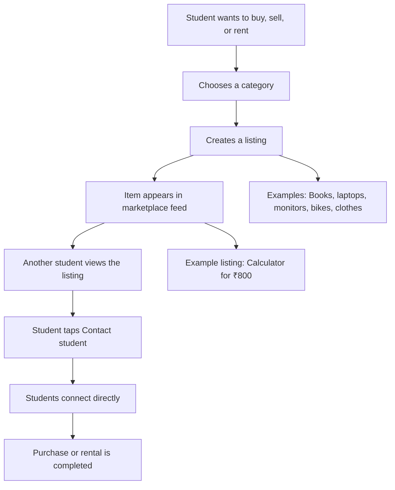

# CampKart

Responsive campus marketplace prototype for college students to buy, sell, or rent items from one another.

## Project Flow

## Run

Open `index.html` in a browser, or serve the folder with any static server if you prefer.