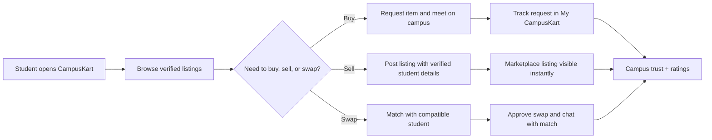

#  CampusKart — “Buy. Sell. Swap. Right on Campus.”

**Exclusive Verified Student-Only Marketplace & Kart Swap Network**

Built for College Hackathons / Brain Wave Competition 2026.

---

##  Active Public Live Demo

Your live application is actively tunneled and publicly reachable at:

🔗https://campuskart-pnp3.onrender.com

*(Anyone on any network, mobile data, or Wi-Fi can open this link on their phone or laptop)*

---

##  App Flow


```mermaid
flowchart LR
    A[Student opens CampusKart] --> B[Browse verified listings]
    B --> C{Need to buy, sell, or swap?}
    C -->|Buy| D[Request item and meet on campus]
    C -->|Sell| E[Post listing with verified student details]
    C -->|Swap| F[Match with compatible student]
    D --> G[Track request in My CampusKart]
    E --> H[Marketplace listing visible instantly]
    F --> I[Approve swap and chat with match]
    G --> J[Campus trust + ratings]
    H --> J
    I --> J
```

##  Quick Start (Local Development & Tunnel)

### Method A: 1-Click Launcher (Windows)
Double-click `start-demo-tunnel.bat` to launch both the Vite server and the Cloudflare Tunnel simultaneously.

### Method B: Manual Commands

**Terminal 1 — CampusKart Vite Server:**
```bash
npm run dev
```

**Terminal 2 — Public HTTPS Cloudflare Tunnel:**
```powershell
 tunnel --url http://localhost:5173
```

---


###  Flow C (Signature Feature): Kart Swap Live Matcher
1. Click **Kart Swap** in navbar (or `/swap`).
2. Select **"I Have: Economics Textbook"** and **"I Want: Scientific Calculator"**.
3. Click **"Find Swap Matches"**.
4. View the **92% Match with Priya (ECE 3rd Year)**.
5. Click **"Request Swap"** ➔ Send swap proposal ➔ Real-time notification and direct chat connection enabled with zero money exchanged.

###  Flow A: Search, Details & Buy Flow
1. Search **"calculator"** on the Home or Explore page.
2. Open **Casio Scientific Calculator (₹500)**.
3. Review verified student trust badges, campus pickup spot, and seller ratings.
4. Click **"Buy / Request Item"** ➔ Select pickup location (e.g. *Central Library*) ➔ Confirm Request.
5. Open **My CampusKart** (`/my-campuskart`) ➔ Mark as received ➔ Submit a 5-star peer rating.

###  Flow B: Post a Listing Flow
1. Click **"+ Sell an Item"** (`/sell`).
2. Click **"Demo Auto-Fill (Flow B)"** for rapid presentation.
3. Review the pre-filled *Python Programming Book (₹280, Like New)*.
4. Click **"Post Item to Marketplace"** ➔ Confetti celebration 🎉 ➔ Listing immediately appears in Marketplace and My Listings.

###  Flow D: Admin Analytics & Moderation
1. Navigate to `/admin`.
2. Inspect live metrics (1,250 Students, 486 Active Listings, 2,104 Transactions, ₹48,500 Revenue).
3. Review Category distribution and monthly revenue trajectory charts.
4. Moderate listings, resolve reported items, and manage institutional college partnership requests.

---

##  Soft Pastel Design System

- **Palette**: Sage Green, Mint, Lavender, Powder Blue, Blush Pink, Soft Peach, Warm Off-White, Dark Charcoal text.
- **Components**: 18px–32px rounded corners, glassmorphism, soft ambient shadows.
- **Responsive**: Multi-column desktop grid + mobile bottom navigation bar (**Home | Explore | Sell | Swap | Profile**).

---

##  Safety & Trust Model
- University email verification (`.edu` / `.ac.in` / `.edu.in`).
- Verified Student badges with course and year.
- Designated public campus pickup nodes (Library, Block A, Canteen, Hostels).
- Transparent peer ratings & review feedback.
